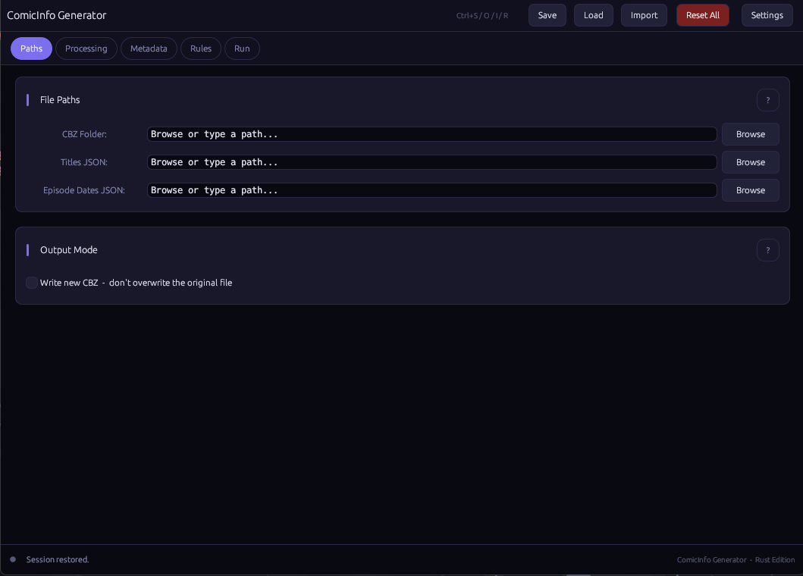
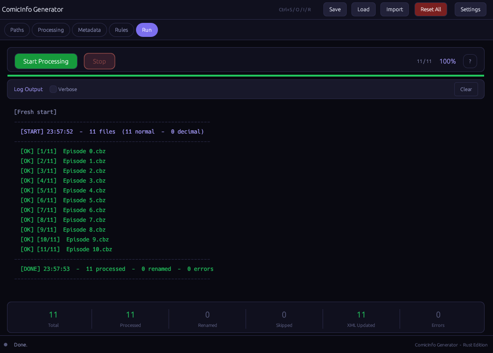

# ComicInfo Generator — Rust Edition

A fast, modern GUI application for generating and embedding `ComicInfo.xml`
metadata into CBZ comic archive files. Full port of the Python/tkinter version
to Rust + egui, with every original feature preserved and a fair amount built
on top since.

---

## Features

| Feature                  | Description                                                                                                          |
| ------------------------ | -------------------------------------------------------------------------------------------------------------------- |
| **Batch CBZ processing** | Embeds `ComicInfo.xml` into every `.cbz` in a folder                                                                 |
| **Parallel processing**  | Rayon thread-pool (configurable worker count)                                                                        |
| **Smart renaming**       | `Episode 1 - Title.cbz` format with zero-padding option                                                              |
| **Prefix modes**         | Auto / Episode / Chapter / Volume / Custom                                                                           |
| **Volume metadata**      | Chapter→Volume rules, per-volume date & summary rules                                                                |
| **Decimal chapters**     | GUI dialog for bonus/extra chapter labelling                                                                         |
| **Final chapter**        | Optional `"Final Chapter: …"` title formatting                                                                       |
| **Post-finale strips**   | Skip prefix for side-stories after finale                                                                            |
| **Session resume**       | Progress log so interrupted runs can continue                                                                        |
| **Dry-run mode**         | Preview all changes without touching any file                                                                        |
| **Config save/load**     | JSON configs with smart filename suggestion                                                                          |
| **Import metadata**      | Merge fields from a `.json` or `.py` file into the current session, without replacing anything else                  |
| **Autosave**             | Session restored automatically on next launch                                                                        |
| **Custom XML fields**    | Any extra `<Tag>Value</Tag>` in ComicInfo.xml                                                                        |
| **4 built-in themes**    | Midnight Violet, Paper Light, Slate Dark, Catppuccin Mocha — switch anytime in Settings, with an animated transition |
| **Keyboard shortcuts**   | Ctrl+S / O / I / R                                                                                                   |

---

## Screenshots

**Paths tab** — point at your CBZ folder and optional JSON files:



**Run tab** — live log and stats as a batch completes:



---

## Download a release

Prebuilt installers for every platform are attached to each
[GitHub Release](../../releases) — no need to install Rust or build from
source unless you want to:

| Platform                               | File                                                                                                                                           |
| -------------------------------------- | ---------------------------------------------------------------------------------------------------------------------------------------------- |
| Windows                                | `comicinfo-generator-windows-x64.exe`                                                                                                          |
| Linux (Debian / Ubuntu)                | `comicinfo-generator-linux-x64.deb`                                                                                                            |
| Linux (Fedora / RHEL / openSUSE)       | `comicinfo-generator-linux-x64.rpm`                                                                                                            |
| Linux (any distro, no package manager) | `comicinfo-generator-linux-x64.tar.gz` — includes an `install.sh` that adds a desktop launcher entry and icon under `~/.local`, no root needed |
| macOS (Intel)                          | `comicinfo-generator-macos-x64.tar.gz`                                                                                                         |
| macOS (Apple Silicon)                  | `comicinfo-generator-macos-arm64.tar.gz`                                                                                                       |

The `.deb` and `.rpm` packages, and the Linux tarball's `install.sh`, all
register a proper desktop entry and icon so the app shows up correctly in
your application launcher and task switcher instead of as a bare process.
The macOS tarballs contain a real `.app` bundle.

### macOS: "app is damaged and can't be opened"

Neither macOS build is code-signed or notarized (that needs a paid Apple
Developer account), so Gatekeeper quarantines both `.app` bundles the
first time they're opened. On Apple Silicon (arm64) this quarantine
check is stricter than on Intel and blocks the app outright with a
message claiming it's damaged or corrupted — it isn't; the download is
fine, this is just Gatekeeper refusing to run an unsigned app and
wording it misleadingly. Intel Macs (or Apple Silicon running the
Intel build under Rosetta) usually get a milder "unidentified
developer" prompt instead, which is why this tends to only get
reported on M-series Macs.

Clear the quarantine flag once, after unzipping, and it'll open
normally from then on:

```bash
xattr -cr "ComicInfo Generator.app"
```

On current macOS versions, right-click → Open no longer reliably
bypasses this specific "damaged" message the way it does for the
milder "unidentified developer" warning, so the command above is the
dependable fix. If you'd rather avoid Terminal, the alternative is
System Settings → Privacy & Security → scroll to Security → click
**Open Anyway** next to the ComicInfo Generator warning (only appears
after you've tried opening the app at least once). Either only needs
doing once per download.

---

## Building from source

### Requirements

| Tool         | Minimum version                                         |
| ------------ | ------------------------------------------------------- |
| Rust + Cargo | **1.80** (install via [rustup.rs](https://rustup.rs))   |
| On Linux     | `libgtk-3-dev`, `pkg-config`, and either X11 or Wayland |

### Linux dependencies

```bash
# Debian / Ubuntu
sudo apt install libgtk-3-dev pkg-config build-essential

# Fedora / RHEL
sudo dnf install gtk3-devel pkg-config gcc

# Arch
sudo pacman -S gtk3 pkg-config base-devel
```

### Build

```bash
# Debug (fast compile, larger binary)
cargo run

# Release (optimised, small binary, no console on Windows)
cargo build --release
# Binary at: target/release/comicinfo-generator
```

### Cross-compile for Windows (from Linux)

```bash
rustup target add x86_64-pc-windows-gnu
sudo apt install mingw-w64
cargo build --release --target x86_64-pc-windows-gnu
```

### Cutting a release

Pushing a tag matching `v*.*.*` (e.g. `v1.0.0`, `v1.1.0-beta.1`) triggers
`.github/workflows/release.yml`, which builds and attaches all 6 platform
artifacts listed above to a GitHub Release automatically.

```bash
git tag v1.0.0
git push origin v1.0.0
```

---

## Cross-platform notes

| OS                | Backend                                            |
| ----------------- | -------------------------------------------------- |
| **Windows**       | Win32 via winit — console hidden in release builds |
| **macOS**         | Cocoa via winit                                    |
| **Linux X11**     | OpenGL via glutin (eframe glow renderer)           |
| **Linux Wayland** | OpenGL via EGL; XWayland also works automatically  |

The app sets `WINIT_UNIX_BACKEND=wayland` or `=x11` automatically via
winit's runtime detection. File-open/save dialogs are provided by the `rfd`
crate; on Linux this currently uses the XDG Desktop Portal backend (not
GTK directly), so dialogs match your desktop environment's native picker
where a portal is available, falling back gracefully otherwise.

---

## Usage

### Workflow

1. **Paths tab** — point at your CBZ folder and optional JSON title/date files
2. **Processing tab** — set mode (Manga/Manhwa), prefix style, separators, zero-padding, worker count
3. **Metadata tab** — fill in constant ComicInfo fields (Series, Writer, Publisher, …)
4. **Rules tab** — define chapter→volume mappings, per-volume publication dates/summaries
5. **Run tab** — hit **Start Processing**; watch the live log; stats appear at the bottom

### JSON title files

```json
{
  "1": "Rise of the Hero",
  "2": "The Dark Forest",
  "2.5": "Bonus: Side Story"
}
```

Keys are chapter/volume numbers as strings (decimal OK).

### Config files: Save, Load, and Import

- **Save** (Ctrl+S) writes your full current session to a JSON file. The
  filename is auto-suggested from your folder/series name.
- **Load** (Ctrl+O) opens a saved config file and **replaces the entire
  current session** with it — paths, rules, metadata, everything.
- **Import** (Ctrl+I) reads fields from a `.json` or `.py` file and
  **merges** them into your current session, without touching anything
  the file doesn't mention. Use this to pull in metadata or rules without
  losing what you already have set up.

Both Load and Import understand older config file formats too (including
ones predating the current metadata-field structure), so a config saved
by a previous version should still bring its data across correctly.

### Autosave

Settings are saved to `~/.comicinfo_autosave.json` every 30 seconds and on exit.

### Settings

The Settings button in the toolbar opens app-wide preferences:

- **Safety**: back up original files before overwriting
- **Theme**: choose between Midnight Violet, Paper Light, Slate Dark, and
  Catppuccin Mocha — switching is instant with an animated cross-fade
- **Notifications**: play a sound when a run finishes
- **About**: current version and a link to this repository

---

## Project layout

```
src/
  main.rs        — entry point, window setup, embedded window icon
  app.rs         — full egui UI: tabs, dialogs, toolbar, Settings window
  worker.rs      — background processing thread
  processing.rs  — CBZ/XML logic, filename parsing, rule lookups
  state.rs       — AppConfig, AppSettings, RunStats, LogEntry types
  theme.rs       — theme palettes, runtime theme switching, egui style setup
build.rs         — embeds the app icon into the Windows .exe
assets/          — app icon (source .svg plus generated .ico/.icns/.png set), screenshots/
packaging/       — Linux .desktop file + install.sh, macOS Info.plist
```

---

## License

MIT — do whatever you want with it.
